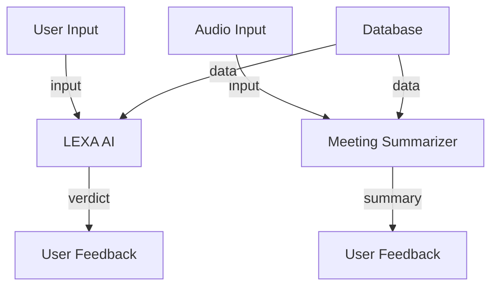

# Project Overview
The ToolBoss application is designed to provide a platform for autonomous compliance and claims verification. It utilizes a combination of natural language processing (NLP) and machine learning algorithms to analyze user input and provide a verdict based on a set of predefined rules and policies.

# Key Features
The application features two main components: LEXA AI and Meeting Summarizer. LEXA AI is a digital arbitrator that uses NLP to analyze user input and provide a verdict based on a set of predefined rules and policies. The Meeting Summarizer is a tool that uses speech recognition and NLP to summarize meetings and extract action items.

# Architecture
The application is built using a microservices architecture, with each component communicating with the others through RESTful APIs. The LEXA AI component uses a state machine to manage the workflow, while the Meeting Summarizer uses a pipeline approach to process audio files.

# Project Structure
The project is structured into several directories, including `modules` for the LEXA AI and Meeting Summarizer components, `pages` for the web application, and `app.py` for the main application entry point.

# Tech Stack
The application uses a range of technologies, including Python, Streamlit, and Langchain, as well as several NLP and machine learning libraries.

# Main Components
The main components of the application include `app.py`, which is the main entry point for the application, `modules/lexa/engine.py`, which manages the LEXA AI workflow, and `pages/summarizer_page.py`, which handles the Meeting Summarizer functionality.

# Installation
To install the application, clone the repository and run `pip install -r requirements.txt`. Then, run `streamlit run app.py` to start the application.

# Configuration
The application uses environment variables to configure the LEXA AI and Meeting Summarizer components. These variables can be set in a `.env` file or through the command line.

# Usage
To use the application, navigate to the web interface and select either the LEXA AI or Meeting Summarizer component. Follow the prompts to input data and receive a verdict or summary.

# Workflow
The workflow for the LEXA AI component involves the following steps:
1. User input: The user inputs a story or claim.
2. Intake: The input is processed and structured into a JSON object.
3. Analysis: The JSON object is analyzed using NLP and machine learning algorithms.
4. Verdict: A verdict is generated based on the analysis.

The workflow for the Meeting Summarizer component involves the following steps:
1. Audio input: The user uploads an audio file.
2. Transcription: The audio file is transcribed using speech recognition.
3. Summary: The transcript is summarized using NLP algorithms.
4. Action items: Action items are extracted from the summary.

# Architecture Overview
The ToolBoss application is built using a microservices architecture, with each component communicating with the others through RESTful APIs.

# High-Level Design
The application is designed to be scalable and flexible, with each component able to be updated or replaced independently.

# Project Structure
The project is structured into several directories, including `modules` for the LEXA AI and Meeting Summarizer components, `pages` for the web application, and `app.py` for the main application entry point.

# Execution Flow
The execution flow for the LEXA AI component involves the following steps:
1. User input: The user inputs a story or claim.
2. Intake: The input is processed and structured into a JSON object.
3. Analysis: The JSON object is analyzed using NLP and machine learning algorithms.
4. Verdict: A verdict is generated based on the analysis.

The execution flow for the Meeting Summarizer component involves the following steps:
1. Audio input: The user uploads an audio file.
2. Transcription: The audio file is transcribed using speech recognition.
3. Summary: The transcript is summarized using NLP algorithms.
4. Action items: Action items are extracted from the summary.

# Data Flow
The data flow for the application involves the following steps:
1. User input: The user inputs data into the application.
2. Processing: The input data is processed and analyzed using NLP and machine learning algorithms.
3. Storage: The processed data is stored in a database.
4. Retrieval: The stored data is retrieved and used to generate a verdict or summary.

# Module Relationships
The modules in the application are related as follows:
* `app.py` is the main entry point for the application and imports the `LEXA AI` and `Meeting Summarizer` components.
* `modules/lexa/engine.py` manages the LEXA AI workflow and imports the `interviewer` and `auditor` components.
* `pages/summarizer_page.py` handles the Meeting Summarizer functionality and imports the `transcription` and `summary` components.

# AI / ML Components
The application uses several AI and ML components, including:
* `langchain` for NLP and machine learning tasks
* `streamlit` for building the web application
* `whisper` for speech recognition

# Storage and Data Layer
The application uses a database to store processed data and retrieve it for generating verdicts or summaries.

# External Services
The application does not use any external services.

# Technologies Used
The application uses a range of technologies, including Python, Streamlit, and Langchain, as well as several NLP and machine learning libraries.
